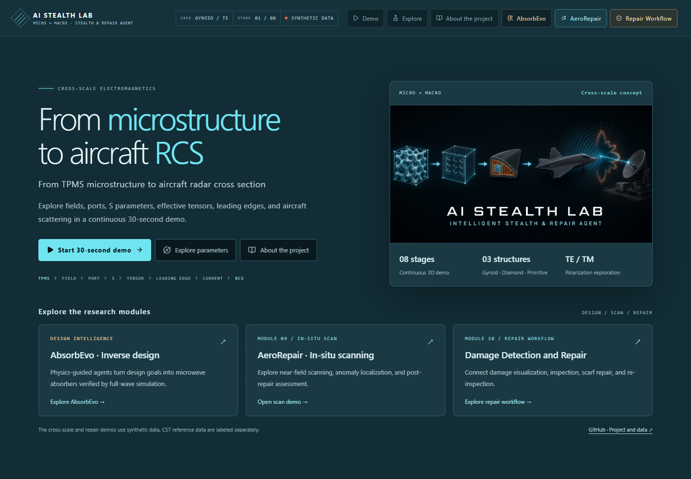

# AI Stealth Lab

**From microstructure to aircraft RCS and repair assessment.**

[](https://zhichengfeng.github.io/ZhichengFeng-Stealth-lab/)
[](#local-preview)
[](#data-and-scope)



An interactive electromagnetics showcase connecting TPMS unit cells, local fields, port responses, effective materials, aircraft scattering, and repair assessment. Start with a continuous 30-second 3D demo, then explore parameters and inspection workflows.

This repository contains the published static website. The full cross-scale workflow uses synthetic demonstration data; an independent CST honeycomb reflection reference is labeled separately.

## Explore

| Entry | What to explore |
| --- | --- |
| **[Stealth Lab](https://zhichengfeng.github.io/ZhichengFeng-Stealth-lab/)** | Eight linked stages, parameter controls, charts, and project overview |
| **[Demo](https://zhichengfeng.github.io/ZhichengFeng-Stealth-lab/demo/)** | Dedicated demonstration and recording entry |
| **[AbsorbEvo](https://github.com/ZhichengFeng/AbsorbEvo)** | Physics-guided inverse design and the AbsorbBench-36 benchmark |
| **[AeroRepair Scan · Module 09](https://zhichengfeng.github.io/ZhichengFeng-Stealth-lab/aerorepair-scan/)** | Near-field scan concepts, anomaly localization, and post-repair assessment |
| **[Repair Workflow · Module 10](https://zhichengfeng.github.io/ZhichengFeng-Stealth-lab/repair-workflow/)** | Damage states, ultrasonic and electromagnetic inspection, and scarf repair |

Select **Start 30-second demo**, then **Explore** to compare Gyroid, Diamond, and Primitive structures under TE and TM polarization. Every AbsorbEvo entry opens its independent project page.

## Cross-scale workflow

```text
01 TPMS cell → 02 Local fields → 03 Port fields / S parameters → 04 Effective tensor
                                                                    ↓
08 Far-field RCS ← 07 Surface currents ← 06 Aircraft illumination ← 05 Leading edge
      ↓
Damage inspection → Scarf repair → Post-repair scanning and assessment
```

The 3D scene, timeline, controls, and charts share the same state. Adjust geometry, polarization, frequency, incidence angle, and viewing scale to explore fields, reflection and transmission, effective permittivity, surface hotspots, and angular RCS.

### Geometry references

| Gyroid | Diamond | Primitive |
| :---: | :---: | :---: |
|  |  |  |

| Leading-edge TPMS | Homogenized leading edge | Absorbing honeycomb |
| :---: | :---: | :---: |
|  |  |  |

These images document reference geometry. The homepage illustration is conceptual, and the interactive scene uses lightweight models.

## Design and repair modules

### [AbsorbEvo · Inverse design](https://github.com/ZhichengFeng/AbsorbEvo)

AbsorbEvo translates design goals into microwave-absorber proposals using language-model planning, physics-prior ranking, and full-wave verification. It studies coated honeycomb sandwich and TPMS structures, with a separate loop for learning reusable design Skills.

Its project page provides the architecture, workflow, research examples, citation, and **AbsorbBench-36** task-and-evaluation package. Stealth Lab links directly to that page for the current project details.

### AeroRepair Scan · In-situ assessment

Explore a dual-polarization probe, portable VNA, position tracking, edge computing, and reference data. Six synthetic scenarios provide frequency, polarization, and standoff controls, animated scans, heatmaps, and assessment summaries.

The module runs in native HTML, CSS, and JavaScript. See the [module guide](aerorepair-scan/README.md).

### Repair Workflow · Damage detection and repair

| Stage | Interaction |
| --- | --- |
| **Damage** | Rotate a sandwich cutaway and compare intact, impact, perforated, and repaired states |
| **Sense** | Explore A-scan waveforms, Hilbert envelopes, and a six-point ultrasonic scan |
| **Probe** | Compare S11 curves and near-field maps; review the near-to-far-field method |
| **Repair** | Follow assessment, scarfing, core replacement, ply placement, curing, and inspection |

Three.js is bundled locally, and the demo data are reproducible. See the [module guide](repair-workflow/README.md).

## Data and scope

| Content | Data type | Scope |
| --- | --- | --- |
| Six TPMS-to-RCS cases | Synthetic demonstration | Three TPMS structures × TE / TM |
| CST honeycomb reflection cache | Independent full-wave reference | 8–12 GHz, 1,001 frequencies, TE / TM co-polarized reflection; no S21 |
| TPMS, leading-edge, and aircraft models | Lightweight geometry | Interactive representations, not vertex-identical CST meshes |
| AbsorbEvo | Independent research project | Current method, examples, and benchmark are documented in its own repository |
| Scan and repair modules | Synthetic concept demos | Inspection and repair workflows, not validated defect estimates or acceptance results |

The demonstration does not establish aircraft RCS, prediction accuracy, or stealth improvement. The independent CST cache does not validate the full TPMS-to-RCS workflow. Review the [manifest](data/manifest.json), [validation report](data/validation_report.json), and [CST provenance](data/real/cst_honeycomb_smoke.provenance.json).

## Local preview

This is a **static GitHub Pages distribution**, containing built application assets and native modules. It does not include the React / TypeScript source project or an npm build configuration.

From the parent directory, run:

```powershell
git clone https://github.com/ZhichengFeng/ZhichengFeng-Stealth-lab.git
python -m http.server 3000 --bind 127.0.0.1
```

Open [the local homepage](http://127.0.0.1:3000/ZhichengFeng-Stealth-lab/). The other entries use `/demo/`, `/aerorepair-scan/`, and `/repair-workflow/` under the same project path.

Keep the directory name `ZhichengFeng-Stealth-lab` and serve it from its parent: the main application includes that URL prefix. Use HTTP and a WebGL-capable browser.

## Structure and maintenance

```text
index.html / demo/       Main application and demo entry
assets/                 Built application, visual enhancements, and navigation
data/                   Synthetic cases, manifest, and independent CST reference
models/ / reference/    Lightweight models, provenance, and geometry images
aerorepair-scan/         Native scan module
repair-workflow/         Native inspection and repair module
docs/                   Maintenance guide and screenshots
tools/                  Static reference and data integrity checks
```

The main application was built with vinext / Next.js App Router, React 19, TypeScript, Three.js / React Three Fiber, GSAP, Zustand, and ECharts. Data generation uses Python. The native repair modules require no running Python backend.

Before publishing, run:

```powershell
python tools/check_site.py
```

Then verify rendering, navigation, charts, and mobile layout in a browser. See the [maintenance guide](docs/maintaining-static-site.md). GitHub Pages serves the repository root; changes pushed to `main` are live after the Pages deployment succeeds.

Author: **Zhicheng Feng**. See [LICENSE](LICENSE) for usage terms.
